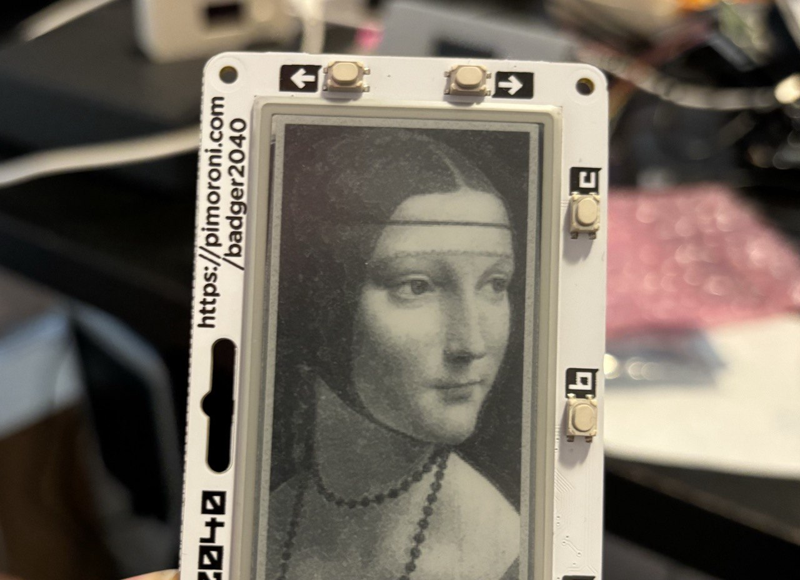

This is a MicroPython driver for the Badger 2040 eink display and other displays based on the UC8151 / IL0373 chip (these are two names for the same chip). This implementation was written using as references:

1. The original Pimoroni [C++ driver](https://github.com/pimoroni/pimoroni-pico/blob/main/drivers/uc8151/uc8151.cpp) for the Badger 2040.
2. The UC8151 chip datasheet that [can be found here](https://cdn.shopify.com/s/files/1/0174/1800/files/ED029TC1_Final_v3.0_20161012.pdf) but looks somewhat a reserved document.
3. The IL0373 chip datasheet that is included in this repository, and is a better resource than the UC8151 datasheet.
3. [This very useful gist](https://gist.github.com/joeycastillo/4cad38cc8e5cb3d5010265bc1bbd92ba) describing the LUTs layout. The same description is provided in the IL0373 chip datasheet, but the gist is a bit more a tutorial, in case it's the first time you approach e-ink displays and their lookup tables.
4. Other random bits on the internet.



This driver is a bit different compared to other drivers for e-paper displays:

* It uses *computed* lookup tables (LUTs) for all update speeds greater than zero (for speed 0, internal OTP LUTs are used). Normally drivers use fixed LUTs tables obtained by other drivers, application notes or hand-made. Computed LUTs allow to provide more refresh modes with different compromises between quality and speed (the speed parameter can be floating point, like 2.5). More than anything else, computed LUTs are **understandable**, and not magical. This approach also uses less MicroPython memory, and makes experimenting with different refresh startegies much easier.
* Anti-flickering refresh modes. If this option is selected, waveform LUTs are modified for special modes where the display will not flicker like normally done by e-ink screens during all-screen updates. This is at the cost of different levels of ghosting (the severity of ghosting depends on speed). I just happen to hate the flickering much more than the delay of EPDs, and in general for many applications (imagine a clock) the flickering ruins the party. In this modes, from time to time the display performs a full flickered refresh to start again with a fresh image.
* This driver supports displaying images with **up to 32 levels of greys!**, even if the display itself is monochome. The technique I used is documented below.
* The driver is commented in the details of what it does with the chip. So reading it you can learn how the display is setup and used.
* The fast modes still use 100HZ in this driver, not the 200HZ mode: it works better in my tests and may be easier on the display hardware.
* We use +10V high/low voltage, and the common voltage is set to the default value as well (-0.1V). Other drivers use 11V and/or different DCOM voltages to improve contrast, and may stress the hardware a little more.

Other then the above technical changes, the goal of this driver, especially for the MicroPython users and Badger 2040 owners, is to provide an alternative to the official Badger software in order to use the latest official Rasperry Pico MicroPython installs. The Badger software provided by Pimoroni is cool, but if you want to do your own project with the display, using updated MicroPython versions and maximum freedom, to have a stand-alone and fast pure-MP driver is handy.

# Usage

```python
from machine import SPI, Pin

spi = SPI(0, baudrate=12000000, phase=0, polarity=0, sck=Pin(18), mosi=Pin(19), miso=Pin(16))
eink = UC8151(spi,cs=17,dc=20,rst=21,busy=26,speed=2)

# Then write something into the framebuffer and update the display.
eink.fb.text("Test",10,10,1)
eink.update()
```

The driver allocates a 1-bit framebuffer in the `fb` attribute of the object, so you can draw into it with and call `update()` in order to refresh the display, see the MicroPython framebuffer class documentation to check all the drawing primitives you have at your disposal.

By passing `width` and `height` during the initialization it is possible to set the other available resolutions supported by the chip. However this driver was tested only with the default 128 x 296 pixels resolution. Yet, there should not be problems with other resolutions.

Mirroring can be enabled in both x and y axis with the `mirror_x` and `mirror_y` initialization parameters. They are False by default.

## Quick test

To test the driver quickly, do:

    mpremote run uc8151.py

The demo code has pins configured for the Badger 2040.

## Changing speed and enabling anti-flickering

When creating the instance of the driver, it is possible to pass the following parameters:
* `speed`, from 1 to 6. This is the refresh speed of the dispaly. When 0 is used, the display uses the internal waveforms: this provides great quality and uses the temperature adjusted waveforms, but it is very slow. From 1 to 6 (floating point values possible! Since the LUTs waveforms are computed and not fixed) progressively faster LUTs are used. See the table below for the refresh time at each speed.
* `anti_flickering` can be True or False. Default is False. When enabled, the display will not flicker in the way normally done by e-paper displays when updating, with even the non updated pixels turning the reverse color a few times back and forth. Only the upated pixels will flicker and change state. In applications like a clock, or in general when there is a high refresh rate of something "moving", this update style is a lot more nice to see. However with this system ghosting tends to accumulate, so from time to time the display will perform a full refresh.
* `full_update_period`, the number non-flickered updates after which a flickered update is performed when `no_filcerking` mode is enabled. Normally set to 50, but you can change it via the API above. Setting it to 0 means: never do a flickered update, which also works, but the background may look uneven and in the long run the image stored at never touched pixels will wash out.

It is also possible to change speed and flickering mode at runtime:

    eink.set_speed(new_speed,*,no_flickering=None,full_update_period=None)

Update latecy:

| Speed | No Flickering | Response Time |
|-------|---------------|---------------|
| 2     | False         | 1998ms        |
| 2     | True          | 1354ms        |
| 3     | False         | 1032ms        |
| 3     | True          | 710ms         |
| 4     | False         | 389ms         |
| 4     | True          | 389ms         |
| 5     | False         | 227ms         |
| 5     | True          | 227ms         |
| 6     | False         | 148ms         |
| 6     | True          | 147ms         |

Speed 0 and 1 are very slow, most of the times not worth using. However note that speed 0 uses internal LUTs that are temperature adjusted, so if you have an application that will not run at room temperature, you may need to use speed 0.

## Partial updates

TODO: the display API is trivial, but there is to evaluate how to implement this feature, if to use specialized LUTs and so forth. Currently it is very rarely useful, because this driver has fast LUTs and no flickering modes.

## Displaying greyscale images

This driver can show greyscale images. There is a tool to convert PNG files to `gs8` files that the driver can read. You can find it inside the `png2gs8` directory, together with a README explain its usage.

For example try this:

    mpremote cp png2gs8/dama.gs8 :
    mpremote cp uc8151.py :
    mpremote run demo_greyscale.py

The image if the famous painting *Dama con ermellino* by Leonardo D'Avinci will be displayed in 4, 8, 16 and 32 colors, one after the other.

The demo uses just this simple call (with 16 greys, in the example):

    eink.load_greyscale_image("dama.grey",16)

It is possible to display regular GS8 framebuffers, too.

    fb = bytearray(128*296)

    # ... draw in the framebuffer: each byte is one pixel ...
    # fb[y*width+x] = color
    # Alternatively allocate a MicroPython GS8 framebuffer.

    # Then draw the framebuffer on the screen:
    eink.update_greyscale(fb,32)

This is a complete example using MicroPython Framebuffer, filling the screen with squares of different sizes.

```python
gs8buf = bytearray(128*296)
gsfb = framebuf.FrameBuffer(gs8buf,128,296,framebuf.GS8)
square_id = 0
for x in range(0,128,128//4):
    for y in range(0,296,296//8):
        color = int((255/31)*square_id)
        gsfb.fill_rect(x,y,128//4,296//8,color)
        square_id += 1

eink.update_greyscale(gs8buf,32)
```

# What I learned about setting waveforms/LUTs for EDPs

The world of e-paper displays is one of the most undocumented you can find: this is the unfortunate side effects of patented technologies, as there is a strong incentive to avoid disclosing useful information, with the effect of slowing down software progresses towards programming these kind of displays. The only source of information I was able to find:

* Datasheets, but these tend to have zero information about programming waveforms.
* Other drivers LUTs, that are often obtained by trial and error or copied verbatim from tables provided by vendors.
* [Patents](https://patents.google.com/?assignee=E+Ink+Corp)! To protect their technologies, companies have to publish certain details about how they work. There are [a few](https://patentimages.storage.googleapis.com/0a/92/af/0da9da0ee16dfd/US11049463.pdf) describing in detail how waveforms work. Still key information is missing.

Anyway, let's start with a quick reminder on how these displays work:


```
    VCOM   (common voltage)
============  <- transparent layer
 +  +  +   +
  +  +   +    <- positively polarized microcapsules.
+   +  +  +
 -   -   - 
   -   -   -  <- negatively polarized microcapsules.
  -  -   -
============  <- back of the display
  V+ or V- (pixel voltage)

```

Basically black and white EPDs have white and black microcapsules that are
charged in the opposite way. By controlling the VCOM (that is a voltage
common for all the display) and the single pixel voltage, we can attract/repuse white and black particles. So if a current is applied in one direction, black microcapsules will go up and be visible, otherwise white particles go up and the pixel will be lighter.

The chips driving these displays are very configurable, and let us select
the voltages to apply to both VCOM and the one for each pixel. The sequence
of voltages to apply is stored in lookup tables called waveform LUTs.

There isn't just a lookup table, but five of them. One is for VCOM (the common voltage), the other four are for the pixels, because pixels, when updating the display, can be in four different states:

* WB LUT is used if the pixel was black, and should turn black.
* BW LUT is used if the pixel was white, and should turn white.
* WW LUT is used if the pixel was black, and should remain black.
* BB LUT is used if the pixel was white, and souold remain black.

This means that we can apply a different waveform for each of these
states, and that's very handy indeed.

## Lookup table format

Lookup tables for each of the above, are 6x7 matrixes of bytes.
This is an exmaple of LUT for the WB change:

    0x80, 0x20, 0x00, 0x00, 0x00, 0x02,
    0x60, 0x10, 0x10, 0x03, 0x00, 0x01,
    0x40, 0x20, 0x00, 0x00, 0x00, 0x02,
    0x00, 0x00, 0x00, 0x00, 0x00, 0x00,
    0x00, 0x00, 0x00, 0x00, 0x00, 0x00,
    0x00, 0x00, 0x00, 0x00, 0x00, 0x00,
    0x00, 0x00, 0x00, 0x00, 0x00, 0x00

For each row, the meaning is:

    |op1|op2|op3|op4| frames1 frames2 frames3 frams4 repeat

* The first byte represents four operations (currents to apply), as 2 bit integeters.
* The following four bytes is the amount of time, in frames, each voltage should be hold. In this driver we set the display to 100HZ, so a frame duration is 10 milliseconds. If the duration is 0 frames, the corresponding operation is skipped.
* The final byte is the number of times the sequence of four operations should be repeated.

For example let's look at the second row. 0x60 in binary is `01|10|00|00`. The meaning of the two bits sequence is:

    00 - Put to ground
    01 - Put to VDH voltage (10v in our config): pixel becomes black
    10 - Put to VDL voltage (-10v in our config): pixel becomes white
    11 - Floating / Not used.

Note that the voltage applied for VDH/VDL depends on the power configuration set, so the above is just what this driver uses. Other drivers use 11V. And other drivers don't set the DCOM to just a fixed -0.10v voltage, so also exploit setting DCOM to a different voltage as the pixel voltage is modulated.

But let's return back to our row:

    0x60, 0x10, 0x10, 0x03, 0x00, 0x01,

So we have, 01 for 0x10 (16) frames, then 10 for 0x10 (16) frames. This is the part of the LUT that will make the display "flash". It basically means: invert the color to the reverse of what our target color is (since this is the WB LUT, so white to black), then go back to the target color.

Normally conservative LUTs are designed to do something like this, for all the pixles in all the LUTs (WB, BW, WW, BB):

1. Invert the color of the pixel compared to target.
2. Go to the right color, then invert again.
3. Finally go to the target color.

The idea is that with the inversions we move the microcapsules to a known state, then we finally set the right color.

## Faster LUTs

However, especially at room temperature, we can apply much shorter frame durations compared to what is normally used. The effect is less convincing blacks and whites on the screen, and ghosting, since a long back-and-forth among the two colors guarantees to clean up the old pixel setup completely. This allows us to go much faster, as you can see yourself in this driver.

But, irony of life, as we have faster updates, the flashing effect of going back-and-forth becomes very unpleasant. Fortunately we have separated WW and BB tables, so we can apply a different waveform to pixels that are not going to change color: this way most of the image, the one that remains unchanged, will not flicker anymore. What we do in this driver is just that: when no flickering mode is selected, we put the unchanged pixels to ground during the update, and that's it... at the cost of ghosting. Why this creates ghosting, after all we are not touching such pixels? Because normally, even if some ghosting remains (it's part of the game), at each successive update when WW and BB tables drive the pixels back and forth, the previous images memory will clear. But if we take pixels to the ground, we incur indeed into two problems:

1. As I said, ghosting.
2. With enough time, never touched pixels may wash out and look more pale.

So to provide non-flickering modes and at the same time work well in long running applications scenarios, this driver (when a non-flickering mode is selected) from time to time does a fully flickered update, at speed 2. This is normally done every 50 updates.

But please, continue reading the next section to know the full story.

## Burn-ins due to wrong LUTs

You may be wondering, for WW and BB lookup tables, **why don't we reaffirm the pixel status instead**? This would gretly improve the situation, as, even if a pixel is white and will stay white, we could apply the voltage needed to make sure it remains white, and clean any ghosting as well. If we do that, what happens to that pixel is that it sees a DC current applied always in the same sense (or more in one sense than in the other), the result is that it starts to semi-permanently polarize in one direction. The image of those pixels will start to be visible in the display even after days, because the microcapsules are no longer able to move from one direction to the other easily, as they oppose some resistence being *biased* towards one polarization.

I think that this effect in the past tricked a few people believing that with modified LUTs they osserved burn-ins of the pixels that were moved too fast, while actually they were observing a burn-in of *all* the other pixels instead, but the effect to the naked eye is that you see a problem only where there was some animation: actually these are the only pixels that are ok!

How to avoid this issue? Well, we simply need to use charge-neutral BB and WW LUTs. For pixels that are not going to change color, either don't do anything (put to ground), or if you apply voltages, apply them in the same amount in one direction and in the other (like in the back-and-forth common update strategy of EPDs).

* This driver uses charge-netural LUTs for WW,BB, WB and BW at speed up to three.
* For speeds > 3 and when non flickered modes are selected, we use charge-neutral LUTs for WW and BB, and non charge neutral LUTs for WB and BW.

Is it a problem to use non charge neutral tables for WB and BW? In my tests, not, because if we apply an unbalanced waveform to a given pixel when it turns from black to white, when it changes color we will apply *the reverse and symmetrical waveform*, hence the sum is zero.

This is how the tables are set for fast modes at the time of this writing:

```
self.set_lut_row(VCOM,0,pat=0,dur=[p,p,p,p],rep=1)
self.set_lut_row(BW,0,pat=0b10_00_00_00,dur=[p*4,0,0,0],rep=1)
self.set_lut_row(WB,0,pat=0b01_00_00_00,dur=[p*4,0,0,0],rep=1)
self.set_lut_row(WW,0,pat=0b01_10_00_00,dur=[p*2,p*2,0,0],rep=1)
self.set_lut_row(BB,0,pat=0b10_01_00_00,dur=[p*2,p*2,0,0],rep=1)
```

* black to white -> just go to white direction.
* white to black -> jus tgo to black direction.
* white to white, black to black -> back and forth of the same duration.

## Generating grey levels

The e-paper display on the badger (and many other cheap EPDs) use chips that are not able to display different levels of greys. To do so, they would require to have separated waveform lookup tables for different levels of greys, more on-chip memory available, and so forth. However these displays are physically capable of pruducing pixels with a mix of white and black microcapsules exactly like greyscale capable displays.

This driver creates ad-hoc lookup tables that will drive pixels half-way from white to black, depending on the grey to be obtained, one grey after the other, not touching the pixels already set to a different level of grey. To speedup things 3x, a trick is used: the display can update four sets of pixels at the same time, depending on the state change between the OLD and NEW bitmap images stored inside the display video memory. We can provide four different LUTS for the transition from white to white, black to white and so forth (WW, BB, WB, BW). This means that we can set three differnet greys at the same time, and use one of the transition for the pixels that are already set.

So to set for example 16 levels of greys:

1. For each loop, three different grey levels are identified.
2. Two 1-bit framebuffers are created, setting the old/new pixel state so that each grey is identified by one of the possible state changes (`1->0`, `0->1`, `1->1`, `0->0`).
3. Four different LUTs are setup: one for each of the three levels of grey and one that does nothing (for pixels of a grey level not in the three levels we are handling).
4. We repeat step 1 until all the grey levels in the image are set.

# List of supported displays

This is a list of displays brands / names supported by this driver.
Please if your dispaly works, send a pull request or just open an issue
to include it. The list is useful because this driver uses advanced techniques
and waveforms that not may work in all the displays **even if the display is based on the supported chip** (an exception is when using speed 0 and no greyscale features: in this case the internal display lookup tables are used).
For the above reasons, this list should include only displays that were actaully tested by users.

* Pomoroni Badger 2040
* Pomoroni Pico Inky Pack.
